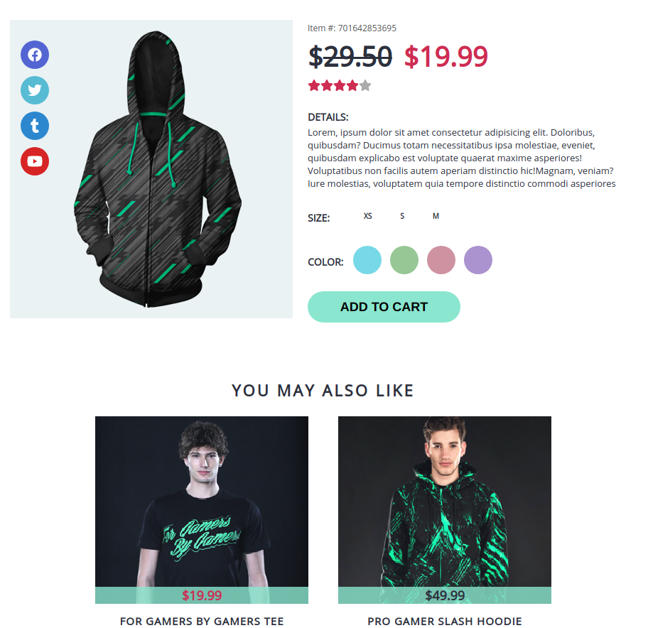
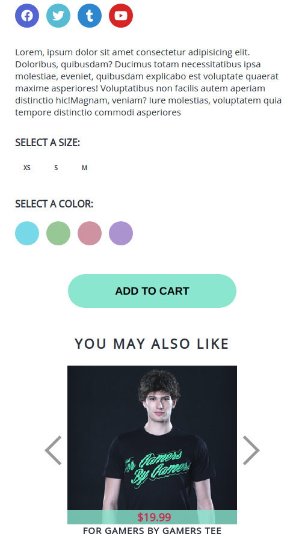

# Project: Gamers clothing

> Implementing a web page of the gamers clothing

## Screenshots




## Built With

- Node.js
- React
- React-DOM
- React-Create-App
- npm
- CSS
- ES6

## Live Demo

[Live Demo Link](https://stormy-sands-45425.herokuapp.com/)

## Installation and Usage


1. Clone the project to your local directory

```
 git clone https://github.com/jstiven01/games-clothing.git
```

2. Get in to the folder app

```
cd games-clothing
```

3. Run React app

```
yarn start
```

## Automated Tests

This project has no automated tests. This will be an upcoming feature

## Upcoming Features

To see the upcoming features check the [issues page](https://github.com/jstiven01/react-calculator/issues)

## Author

👤 **Johan Stiven Tinjacá Tocora**

- Github: [@jstiven01](https://github.com/jstiven01)
- Email: [stiven10@gmail.com](mailto:stiven10@gmail.com)
- Twitter: [@TinjacaJohan](https://twitter.com/TinjacaJohan)
- Linkedin: [Johan Tinjacá](https://www.linkedin.com/in/johanstiventinjaca/)